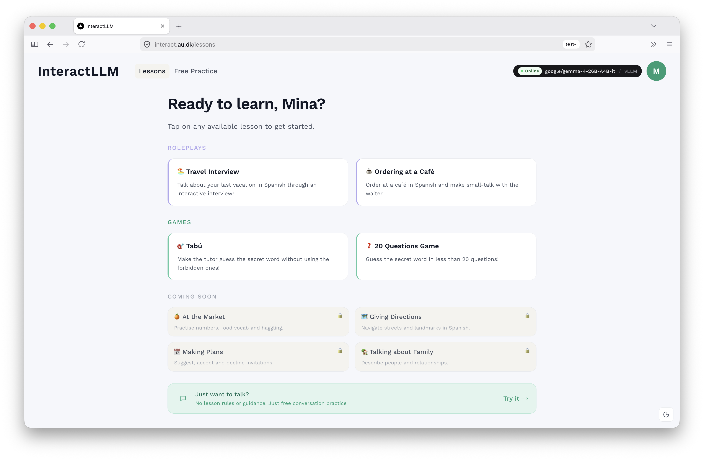

# Frontend
React frontend (built with [Next.js](https://nextjs.org)) for the [InteractLLM backend](https://github.com/INTERACT-LLM/backend). Together, they make up the InteractLLM proof-of-concept.



## 🌟 Overview

The application code lives under `src/`. Top-level folders:

| 📁 Folder | Description | More Info |
| --- | --- | --- |
| `app` | Next.js App Router entry. Route groups (how to switch pages), layouts, server-side API handlers, and global styles. | [README](src/app/README.md) |
| `components` | All React UI components: chat panes, lesson grids, modals, banners, headers, etc. | [README](src/components/README.md) |
| `context` | React Context providers for state that is used by multiple components (LLM config, user profile). | — |
| `hooks` | Custom React hooks for streaming chat, auto-scroll, auto-resize, and game logic (Tabú, 20 Questions). | — |
| `lib` | Client utilities: API endpoint definitions (`api.js`) and JWT gate-token helpers (`gate-token.js`). | — |

`proxy.js` at the project root handles request forwarding to the backend. (Formly known as Next.js middleware; see the [migration note](https://nextjs.org/docs/messages/middleware-to-proxy).)

## 🛠️ Technical Requirements
Developed on macOS (`26.5.1`) and currently deployed on a Linux server. Built with `React 19.2.4` and `Next.js 16.2.3` (App Router, `src/` directory).

Requires `Node.js 20.9` or higher. [Download here](https://nodejs.org/en).

## Project Setup
Install dependencies and start the dev server:

```bash
npm install
npm run dev
```

Open [http://localhost:3000](http://localhost:3000) to view the app. The frontend expects the backend to be reachable at the URL configured in `.env.local` (No setup is needed for local development; it defaults to `http://localhost:8000`).

## Environment Configuration
The frontend reads a few environment variables, all of which have fallbacks or are only required when the password gate is enabled. See [docs/environment_setup.md](docs/environment_setup.md) for details.

## 🚀 Build and Deploy
When you have downloaded dependencies and set the ncecessary env variables, you can:
```bash
npm run build
npm run start
```

The production build is deployed alongside the backend on a Linux server, managed by [PM2](https://pm2.keymetrics.io/). Deploy scripts live on the server and are not committed to this repo.